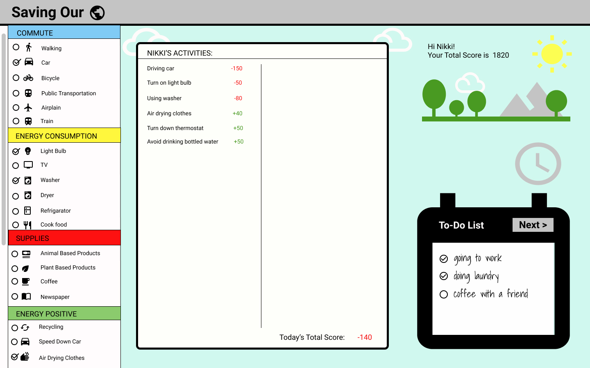
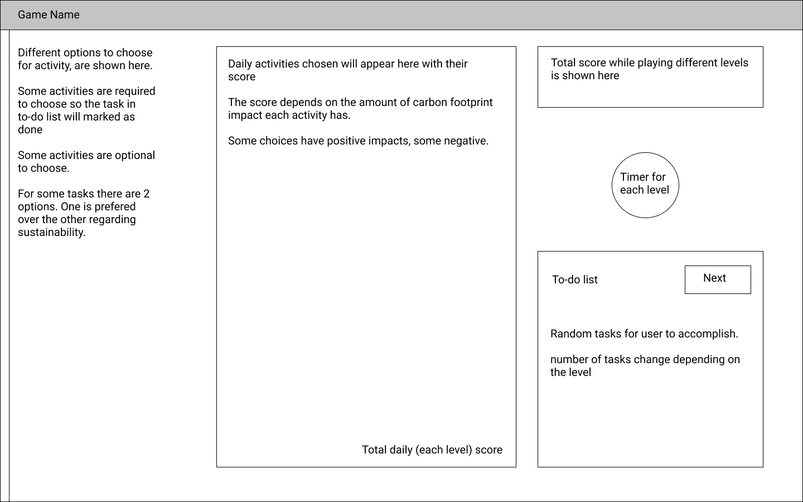
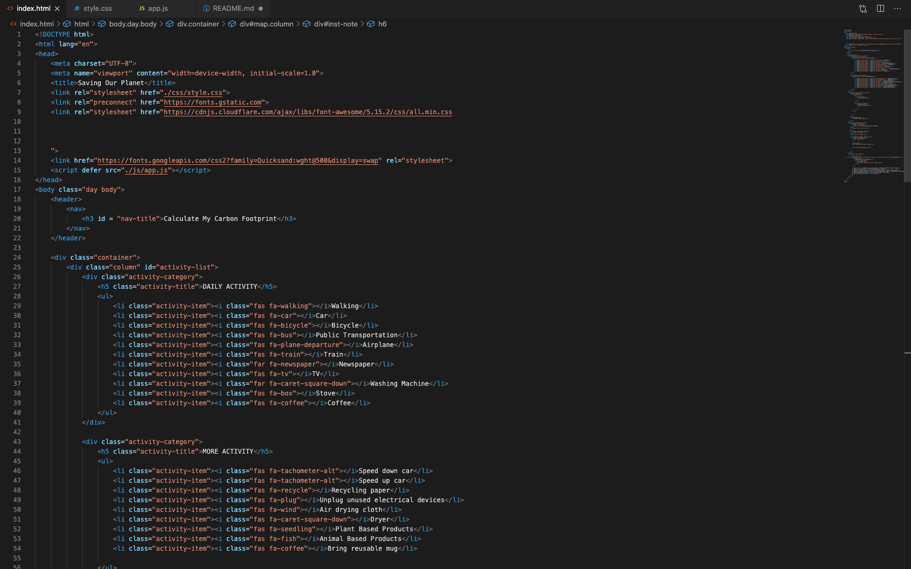
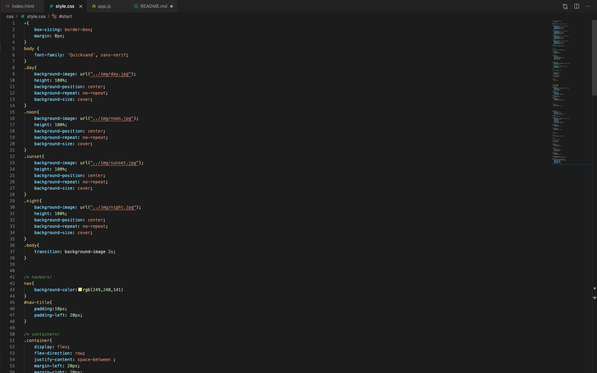
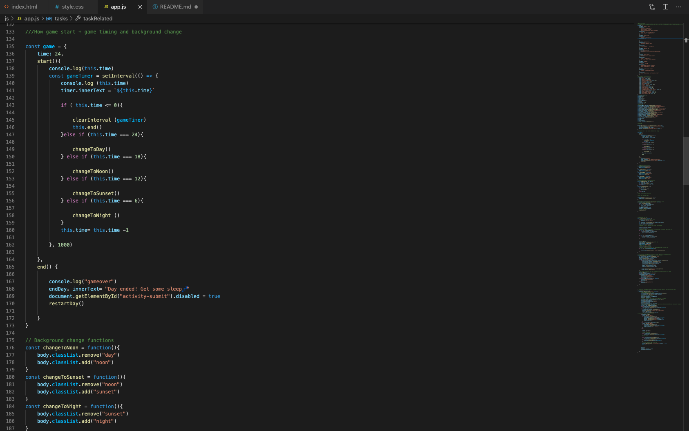

## Project READMEs at 

Example:

# Saving Our 🌎
A game trying to teach the impact of human's daily choices on planet by translating them to carbon footprint scaled scores in simple terms

### Motivation
Sustainability is one of my personal interests and area of study. Carbon dioxide emissions account for 82 percent of today’s global warming. I believe each one of us can take small yet significant steps to protect our planet in our daily activities.

---
### Screenshots
screen captures of your app

---
### User Stories & Wireframes
The planning materials used to build this app.
* High-level user stories.
* image files of wireframes

---
### Technologies & Code Snippets
* list of technologies
HTML, CSS, Javascript
* screen captures of your code

---
### Credits
Give credit to any `codepen` that inspired you, `medium` article that helped you, or `stackoverflow` that pointed you in the right direction.
This article inspired me to crete different tasks and activities in game:
https://www.easel.ly/blog/do-you-know-your-carbon-footprint-a-case-study-infographics/

I used figma to create wireframes:
https://www.figma.com/file/WAgDNrMo6XuK79tGArVdaE/Project-1?node-id=0%3A1

Stackoverflow articles that help me figure out my way:
https://stackoverflow.com/questions/20416803/how-do-i-clear-the-previous-text-field-value-after-submitting-the-form-with-out/20416864
https://stackoverflow.com/questions/2703601/how-to-line-break-from-css-without-using-br
https://stackoverflow.com/questions/18806210/generating-non-repeating-random-numbers-in-js

---

### Future development
What are the next steps for the project? How will you continue to evolve it?

1- Add more tasks with more variable activities to accomplish them. 
2- User could add their own task and get some sustainable activity related to them for suggestion. 
3- Another improvement could be change of win/lose conditions based on game level.

